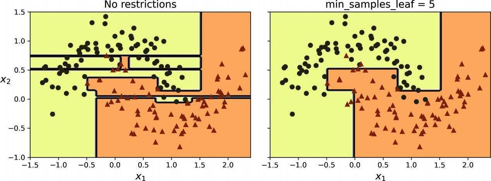
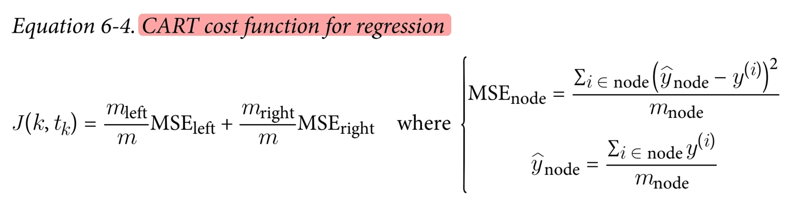
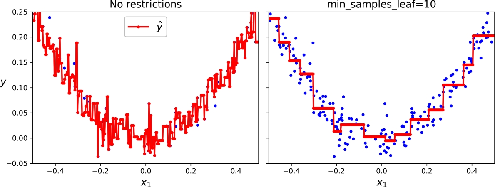
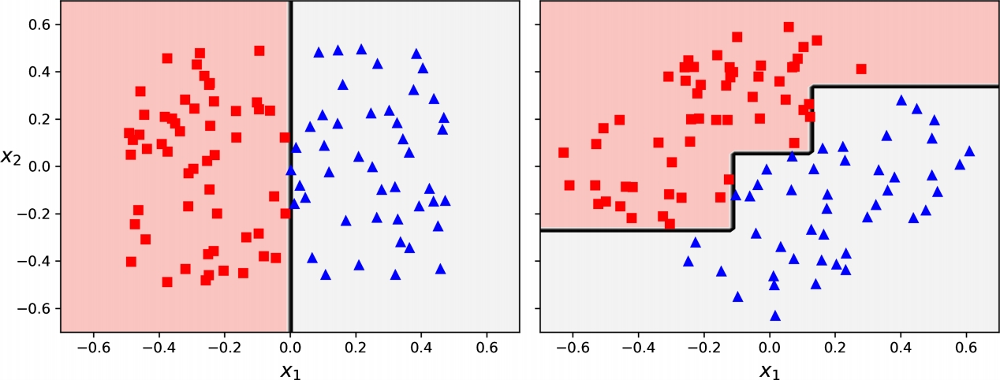

# decision-trees

## Making Predictions
Decison Trees require very little data preparation, they don't require feature scaling or centering at all.

p(i,k) is the ratio of class k instances among the training instances in the ith node.

## The CART Training Algorithm
Scikit-Learn uses the CART(Classification and Regression Tree) algorithm, which produces only binary trees. However, other algorithms, such as ID3, can produce decision trees with nodes that have more than two children.

CART cost function for classification

J(k, t_k) = m_left/m G_left + m_right/m G_right

it searches for the pair (k, t_k), k is the feature and t_k is the threshold (e.g., "petal length <= 2.45 cm").

The tree stops recursing onces it reaches max_depth or cannot find a split that will reduce impurity or other stopping conditions like min_samples_split, min_samples_leaf, min_weight_fraction_leaf, and max_leaf_nodes.

CART is a greedy algorithm. It does not check whether or not the split will lead to the lowest possible impurity several levels down and is not guaranteed to be optimal. finding the optimal tree is known to be an NP-complete problem. It requires O(exp(m)) time.

## Computational Complexity
n: number of features
m: number of samples

Traversing decision tree: O(log(m))
Training decision tree: O(n * m * log(m))

## Gini Impurity or Entropy
Gini impurity is the default but you can change it to entropy impurity too.

Entropy has spread to a wide varitey of domains, including in Shannon's information theory, where it measures the average information content of a message. Entropy is zero when all messages are identical.

p(i,k) is the ratio of class k instances among the training instances in the ith node.

Gini impyrity is slightly faster to compute. When they differ, Gini impurity tends to isolate the most frequent class in its own branch of the tree, while entropy tends to produce slightly more balanced trees.

## Regularization Hyperparameters
Decision trees are nonparametric models, not because it does not have any parameters (it often has a lot) but because the number of parameters is not determined prior to training. A parametric model such as a linear model, has a preditermined number of parameters, so its degree of freedom is limited, reducing the risk of overfitting (but increasing the risk of underfitting).

**Pruning**: A node whose children are all leaf nodes is considered unnecessary if the purity improvement it provides is not statistically significant. Standard statistical tests, such as the chi-squared test (X^2), are used to estimate the probability that the improvement is purely the result of chance (null hypothesis). If this probability, called the p-value, is higher than a given threshold (typically 5%), then the node is considered unnecessary and its children are deleted.

Decision boundary of an unregularized tree(left) and a regularized tree(right)

## Regression

Decision trees are prone to overfitting.

Predictions of an unregularized regression tree (left) and a regularized tree (right)

## Sensitivity to Axis Orientation
On the left, a decision tree can split it easily, while on the right, after the dataset is rotated by 45 degrees, the decisoin boundary looks unnecessarily convoluted. Although both decision trees fit the training set perfectly, it is very likely that the model on the right will not generalize well.

One way to limit this problem is to scale the data, then apply a principal component analysis transformation. It rotates the data in a way that reduces the correlation between features, which often (not always) makes things easier for trees.

