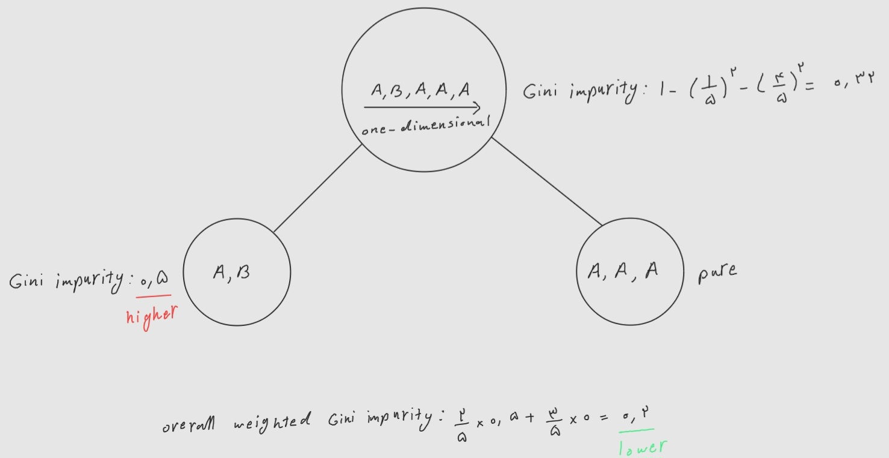

1. What is the approximate depth of a decision tree trained (without restrictions) on a training set with one million instances?
   
   log(1000000)
2. Is a node's Gini impurity generally lower or higher than its parents? Is it **generally** lower/higher, or **always** lower/higher?

   A node's Gini impurity is generally lower than its parent's. It's due to the CART training algorithm cost function, which splits each node in a way that minimizes the weighted sum of its children's Gini impurities. However it's possible for a node to have a higher Gini impurity than its parent, as long as this increase is more than compensated for by a decrease in the other child's impurity. For example:
   

3. If a decision tree is overfitting the training set, is it a good idea to try decreasing max_depth? yes
4. If a decision tree is underfitting the training set, is it a good idea to try scaling the input features? No relation
5. If it takes one hour to train a decision tree on a training set containing one million instances, roughly how much time will it take to train another decision tree on a training set containing ten million instances? 
